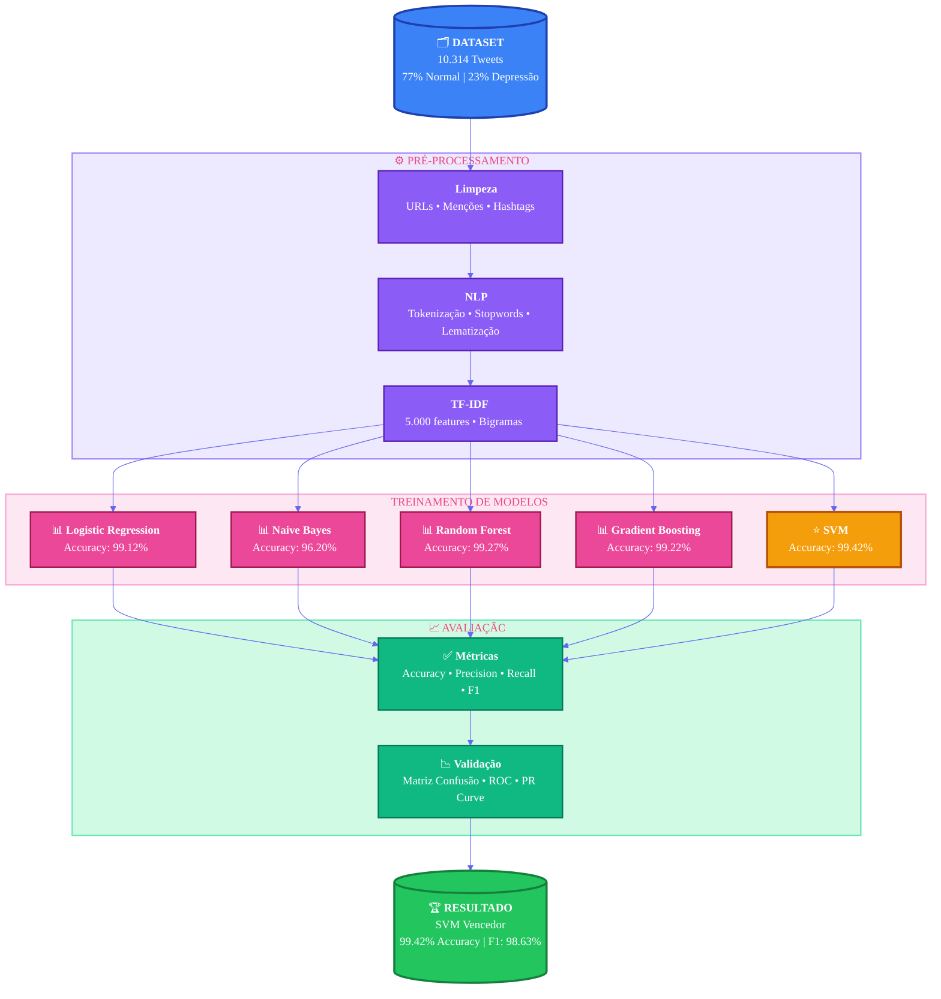

# 🧠 Detecção de Depressão em Redes Sociais

<div align="center">


**Centro Universitário SENAC | Machine Learning Técnicas Projeto Final **


Autores: 
## *Laércio Santos e Anderson Silva*

[📊 Notebook Interativo](https://colab.research.google.com/github/laerciosantos09/Senac-MachineLearning/blob/main/Projeto%20Final/Detec%C3%A7%C3%A3o%20de%20Depress%C3%A3o%20nos%20Tweets.ipynb) | [📄 Artigo Completo](https://github.com/laerciosantos09/Senac-MachineLearning/blob/main/Projeto%20Final/Artigo_Deteccao_Depressao.docx) | [📈 Apresentação](https://github.com/laerciosantos09/Senac-MachineLearning/blob/main/Projeto%20Final/Deteccao-de-Depressao-em-Redes-Sociais%20vfinal.pdf)

</div>

---

## 📋 Sumário

- [Visão Geral](#-visão-geral)
- [Motivação](#-motivação)
- [Metodologia](#-metodologia)
- [Fluxo do Sistema](#-fluxo-do-sistema)
- [Resultados](#-resultados)
- [Dataset](#-dataset)
- [Tecnologias Utilizadas](#-tecnologias-utilizadas)
- [Como Usar](#-como-usar)
- [Limitações e Considerações Éticas](#-limitações-e-considerações-éticas)
- [Trabalhos Futuros](#-trabalhos-futuros)
- [Autores](#-autores)
- [Licença](#-licença)

---

## 🎯 Visão Geral

Este projeto desenvolve um **modelo de Machine Learning capaz de identificar indicativos de depressão em textos publicados no Twitter**, utilizando técnicas de Processamento de Linguagem Natural (NLP) e algoritmos de classificação supervisionada.

### 🔑 Destaques

- ✅ **99.42% de acurácia** com Support Vector Machine (SVM)
- ✅ **99.78% de precisão** na identificação de casos positivos
- ✅ **97.62% de recall** na detecção de indicativos depressivos
- ✅ **F1-Score de 98.69%** demonstrando excelente equilíbrio
- ✅ Comparação de **5 algoritmos** diferentes de ML

---

## 💡 Motivação

> **A OMS estima que mais de 300 milhões de pessoas sofrem de depressão globalmente. A detecção precoce pode salvar vidas.**

A depressão é uma das principais causas de incapacidade em todo o mundo. Com o crescimento das redes sociais, pessoas frequentemente expressam seus sentimentos e estados emocionais online, criando uma oportunidade única para:

- 🔍 **Detecção precoce** de sinais de alerta
- 📊 **Monitoramento em larga escala** de saúde mental pública
- 🤝 **Suporte proativo** através de intervenção assistida por IA
- 📈 **Pesquisa epidemiológica** em tempo real

### ⚠️ Importante

Este modelo é uma **ferramenta auxiliar de triagem**, não substitui diagnóstico clínico profissional. Qualquer indicativo detectado deve ser avaliado por profissional qualificado de saúde mental.

---

## 🔬 Metodologia

### 1️⃣ Dataset

**10.314 tweets rotulados** em inglês:
- 📊 8.000 tweets normais (77.6%)
- 📊 2.314 tweets com indicativos de depressão (22.4%)

🔗 **[Acessar Dataset Completo](https://raw.githubusercontent.com/laerciosantos09/Senac-MachineLearning/main/Projeto%20Final/Database/sentiment_tweets3.csv)**

### 2️⃣ Pré-Processamento

```python
# Pipeline de Processamento
1. Limpeza de dados
   └─ Remoção de URLs, menções (@usuario), hashtags (#tag)
   
2. Processamento de Linguagem Natural (NLP)
   ├─ Tokenização (segmentação textual)
   ├─ Remoção de stopwords (palavras sem valor semântico)
   └─ Lematização (normalização morfológica - NLTK)
   
3. Vetorização TF-IDF
   ├─ 5.000 features máximas
   ├─ N-gramas (1-2) para capturar contexto
   ├─ Min_df=2 (frequência mínima)
   └─ Max_df=0.95 (frequência máxima)
```

### 3️⃣ Modelos Treinados

| Algoritmo | Tipo | Características |
|-----------|------|-----------------|
| **Support Vector Machine (SVM)** | Classificação Linear | Kernel Linear, hiperplanos ótimos |
| **Regressão Logística** | Classificação Linear | Alta interpretabilidade |
| **Random Forest** | Ensemble Learning | 200 estimadores, agregação de decisões |
| **Gradient Boosting** | Aprendizado Sequencial | 100 estimadores, boosting |
| **Naive Bayes** | Probabilístico | Baseado em Teorema de Bayes |

### 4️⃣ Validação

- ✔️ Divisão estratificada 80/20 (treino/teste)
- ✔️ Cross-validation 5-fold
- ✔️ Class_weight='balanced' para lidar com desbalanceamento
- ✔️ Métricas: Accuracy, Precision, Recall, F1-Score, ROC-AUC

---

## 🔄 Fluxo do Sistema



🔗 **[Ver Fluxograma Completo](https://github.com/laerciosantos09/Senac-MachineLearning/blob/main/Projeto%20Final/Fluxo/FluxoDeteccaoDepressao.mermaid)**

---

## 📊 Resultados

### Comparação de Desempenho dos Modelos

| Modelo | Acurácia | Precisão | Recall | F1-Score | ROC-AUC |
|--------|----------|----------|--------|----------|---------|
| **SVM** 🏆 | **99.42%** | **99.78%** | **97.62%** | **98.69%** | **99.85%** |
| Logistic Regression | 99.12% | 99.51% | 97.19% | 98.33% | 99.72% |
| Random Forest | 99.27% | 99.27% | 98.08% | 98.67% | 99.81% |
| Gradient Boosting | 99.22% | 98.57% | 98.51% | 98.54% | 99.76% |
| Naive Bayes | 96.20% | 89.74% | 93.72% | 91.68% | 98.42% |

### 🎯 Performance do SVM (Modelo Vencedor)

```
📈 Validação Cruzada (5-fold): 98.2% (±0.4%)
📊 Matriz de Confusão (2.053 predições):
   ├─ Verdadeiros Positivos: 411
   ├─ Verdadeiros Negativos: 1.630
   ├─ Falsos Positivos: 1
   └─ Falsos Negativos: 11

✅ Taxa de Acerto: 99.42%
❌ Taxa de Erro: 0.58% (12 erros em 2.053 predições)
```

### 📈 Gráfico de Performance

<div align="center">


</div>

---

## 🗂️ Dataset

### Características

- **Total**: 10.314 tweets rotulados
- **Idioma**: Inglês
- **Classes**: Binária (0: Normal, 1: Depressão)
- **Distribuição**: Desbalanceada (77.6% / 22.4%)
- **Formato**: CSV

### Acesso aos Dados

🔗 **[Download Dataset (CSV)](https://raw.githubusercontent.com/laerciosantos09/Senac-MachineLearning/main/Projeto%20Final/Database/sentiment_tweets3.csv)**

### Padrões Linguísticos Identificados

#### 🔴 Tweets COM Depressão
Palavras predominantes: `depression`, `feel`, `life`, `help`, `anxiety`, `stress`, `people`, `way`, `dont`, `know`

**Características**:
- Palavras de emoções negativas
- Pronomes em primeira pessoa singular (`I`, `me`, `my`)
- Referências a solidão e isolamento
- Busca por ajuda e suporte

#### 🟢 Tweets SEM Depressão
Palavras predominantes: `love`, `good`, `day`, `thank`, `haha`, `time`, `great`, `nice`, `friend`, `happy`

**Características**:
- Vocabulário positivo e otimista
- Expressões de gratidão
- Menções a atividades sociais
- Uso de emojis e risadas textuais

---

## 🛠️ Tecnologias Utilizadas

### Core ML & Data Science


### NLP & Text Processing


### Visualização


### Ambiente de Desenvolvimento


---

## 🚀 Como Usar

### Opção 1: Google Colab (Recomendado)

[](https://colab.research.google.com/github/laerciosantos09/Senac-MachineLearning/blob/main/Projeto%20Final/Detec%C3%A7%C3%A3o%20de%20Depress%C3%A3o%20nos%20Tweets.ipynb)

**Clique no badge acima para abrir o notebook diretamente no Google Colab!**

### Opção 2: Instalação Local

```bash
# Clone o repositório
git clone https://github.com/laerciosantos09/Senac-MachineLearning.git

# Navegue até o diretório do projeto
cd "Senac-MachineLearning/Projeto Final"

# Instale as dependências
pip install -r requirements.txt

# Abra o Jupyter Notebook
jupyter notebook "Detecção de Depressão nos Tweets.ipynb"
```

### Dependências Principais

```txt
pandas>=1.3.0
numpy>=1.21.0
scikit-learn>=0.24.2
nltk>=3.6.2
matplotlib>=3.4.2
seaborn>=0.11.1
wordcloud>=1.8.1
```

---

## ⚠️ Limitações e Considerações Éticas

### 🔧 Limitações Técnicas

| Limitação | Descrição | Mitigação |
|-----------|-----------|-----------|
| **Dataset Desbalanceado** | 77.6% sem depressão vs 22.4% com depressão | `class_weight='balanced'` aplicado em todos os modelos |
| **Viés Linguístico** | Dataset em inglês, pode não capturar expressões culturais de outros idiomas | Necessária adaptação para português brasileiro |
| **Escala do Dataset** | 10.314 tweets é relativamente pequeno | Modelos tradicionais (SVM) performam melhor que deep learning nesta escala |
| **Falsos Negativos** | SVM teve 11 falsos negativos em 2.053 predições | Em saúde mental, não detectar casos reais pode ter consequências graves |

### 🛡️ Considerações Éticas

| Aspecto | Implicação | Recomendação |
|---------|-----------|--------------|
| **Não é Diagnóstico Clínico** | O modelo detecta padrões linguísticos, não realiza diagnóstico médico | Qualquer indicativo deve ser avaliado por profissional qualificado |
| **Privacidade e Consentimento** | Monitoramento de redes sociais levanta questões sobre vigilância | Conformidade com LGPD/GDPR é essencial |
| **Estigma e Discriminação** | Uso inadequado pode levar a discriminação | Transparência sobre o uso e limitações do modelo |
| **Intervenção Responsável** | Detecção de risco requer protocolo de resposta adequado | Parceria com profissionais de saúde mental |

### ⚖️ Declaração de Uso Responsável

> **Este modelo deve ser utilizado APENAS como ferramenta auxiliar de triagem em saúde mental. NÃO substitui avaliação clínica profissional. Qualquer indicativo detectado pelo sistema DEVE ser encaminhado para profissional qualificado de saúde mental.**

---

## 🔮 Trabalhos Futuros

### 📌 Curto Prazo
- [ ] Adaptação do modelo para **português brasileiro**
- [ ] Expansão do dataset com mais exemplos
- [ ] Implementação de **API REST** para uso em produção
- [ ] Dashboard interativo para visualização de resultados

### 📌 Médio Prazo
- [ ] **Análise multimodal** (texto + imagem + metadados)
- [ ] Detecção de **outros transtornos mentais** (ansiedade, bipolaridade)
- [ ] **Transfer learning** com modelos pré-treinados (BERT, GPT)
- [ ] Monitoramento temporal (evolução do estado emocional)

### 📌 Longo Prazo
- [ ] Integração com **sistemas de saúde pública**
- [ ] Estudos longitudinais de **eficácia de intervenção**
- [ ] Desenvolvimento de **chatbot de suporte emocional**
- [ ] Pesquisa sobre **padrões epidemiológicos** em tempo real

---


## 📚 Referências

1. **World Health Organization (WHO)**. Depression and Other Common Mental Disorders: Global Health Estimates. Geneva: WHO, 2017.

2. **De Choudhury, M., et al.** "Predicting Depression via Social Media." Proceedings of the International AAAI Conference on Web and Social Media, 2013.

3. **Guntuku, S. C., et al.** "Detecting depression and mental illness on social media: an integrative review." Current Opinion in Behavioral Sciences, 2017.

4. **Cortes, C.; Vapnik, V.** "Support-Vector Networks." Machine Learning, v. 20, n. 3, p. 273-297, 1995.

5. **Pedregosa, F., et al.** "Scikit-learn: Machine Learning in Python." Journal of Machine Learning Research, 2011.

---

## 🔗 Links Úteis

- 📊 [Notebook Jupyter (Abrir no Colab)](https://colab.research.google.com/github/laerciosantos09/Senac-MachineLearning/blob/main/Projeto%20Final/Detec%C3%A7%C3%A3o%20de%20Depress%C3%A3o%20nos%20Tweets.ipynb)
- 📄 [Artigo Completo (DOCX)](https://github.com/laerciosantos09/Senac-MachineLearning/blob/main/Projeto%20Final/Artigo_Deteccao_Depressao.docx)
- 📈 [Apresentação (PDF)](https://github.com/laerciosantos09/Senac-MachineLearning/blob/main/Projeto%20Final/Deteccao-de-Depressao-em-Redes-Sociais_vfinal.pdf)
- 🔄 [Fluxograma Mermaid](https://github.com/laerciosantos09/Senac-MachineLearning/blob/main/Projeto%20Final/Fluxo/FluxoDeteccaoDepressao.mermaid)
- 📊 [Dataset (CSV)](https://raw.githubusercontent.com/laerciosantos09/Senac-MachineLearning/main/Projeto%20Final/Database/sentiment_tweets3.csv)

</div>
